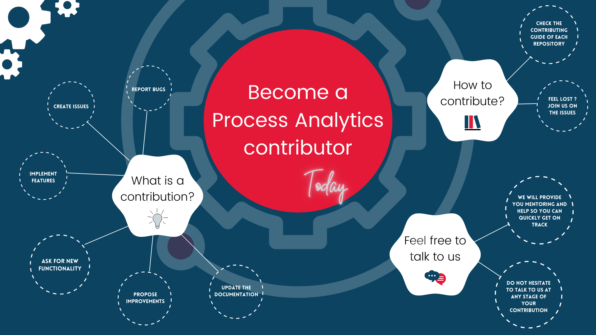

## Hi there, welcome in the Process Analytics 👋

TODO an hero image here?

### 🙋‍♀️ Process Analytics what is this?

🙋‍♀️ A short introduction - Rapidly display meaningful Process Analytics components in your web pages using BPMN 2.0 notation and Open Source libraries.

more details in https://process-analytics.dev/

### 🌈 Contributing to the ecosystem

🌈 Contribution guidelines - how can the community get involved?

👩‍💻 Useful resources - where can the community find your docs? Is there anything else the community should know?

🍿 Fun facts - what does your team eat for breakfast?

TODO hacktoberfest gif or image

 

<!--

**Here are some ideas to get you started:**

🙋‍♀️ A short introduction - what is your organization all about?
🌈 Contribution guidelines - how can the community get involved?
👩‍💻 Useful resources - where can the community find your docs? Is there anything else the community should know?
🍿 Fun facts - what does your team eat for breakfast?
🧙 Remember, you can do mighty things with the power of [Markdown](https://guides.github.com/features/mastering-markdown/)
-->
